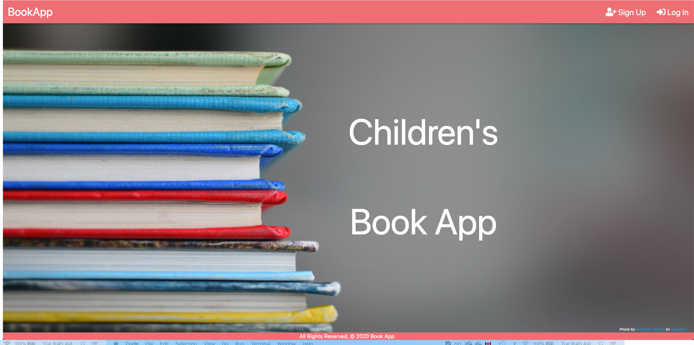
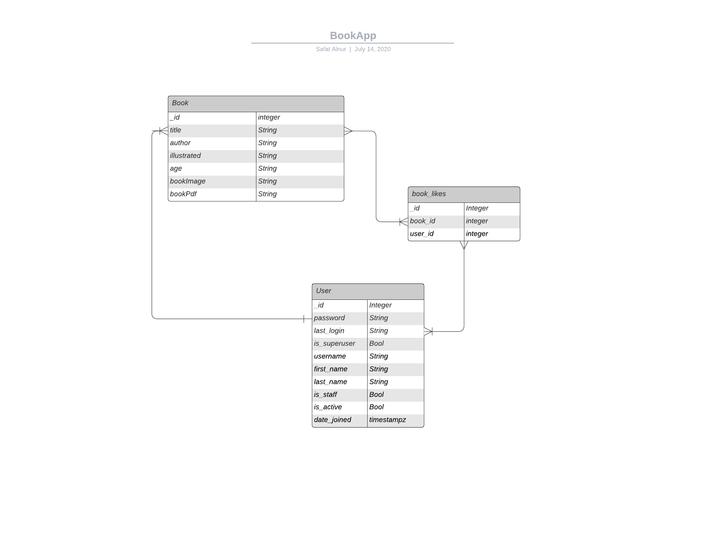
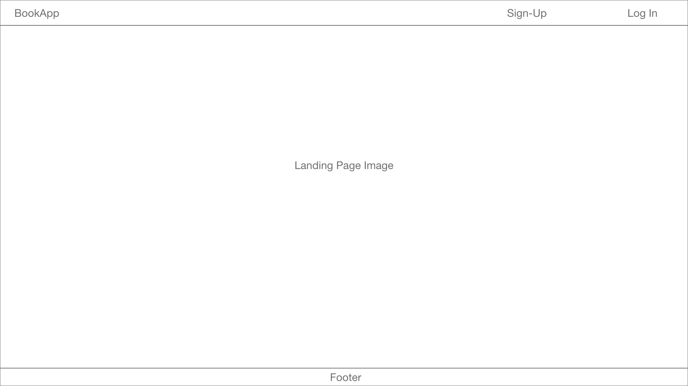
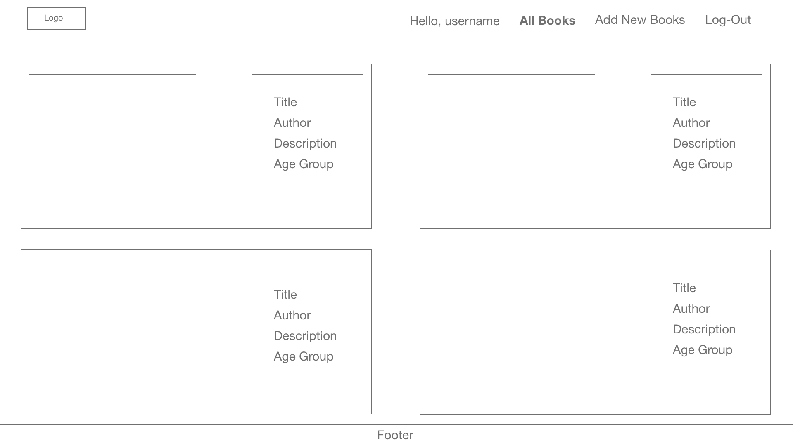
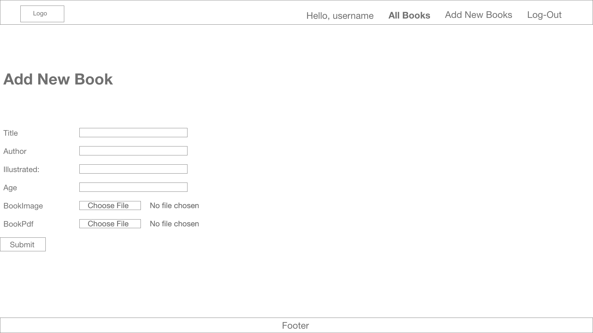
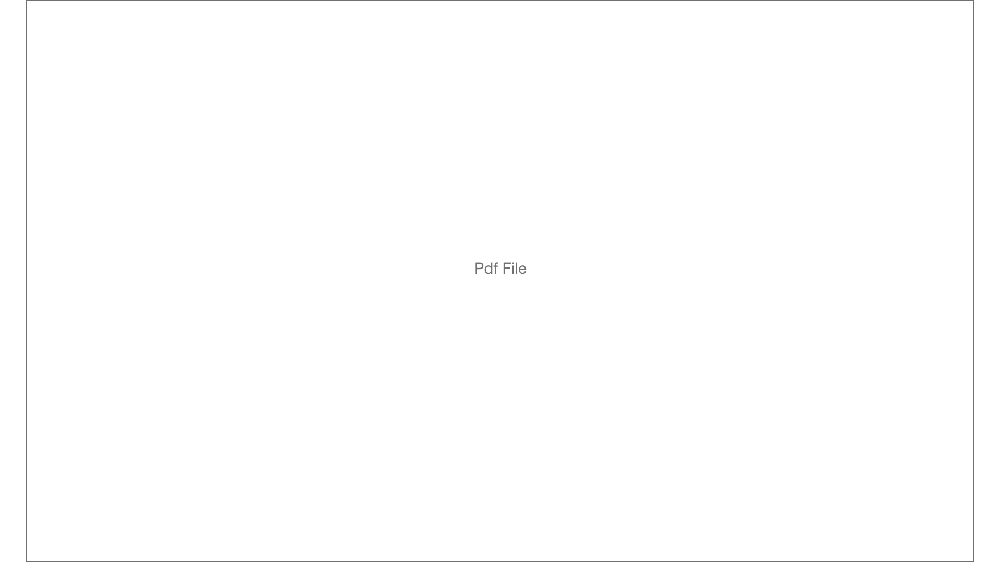
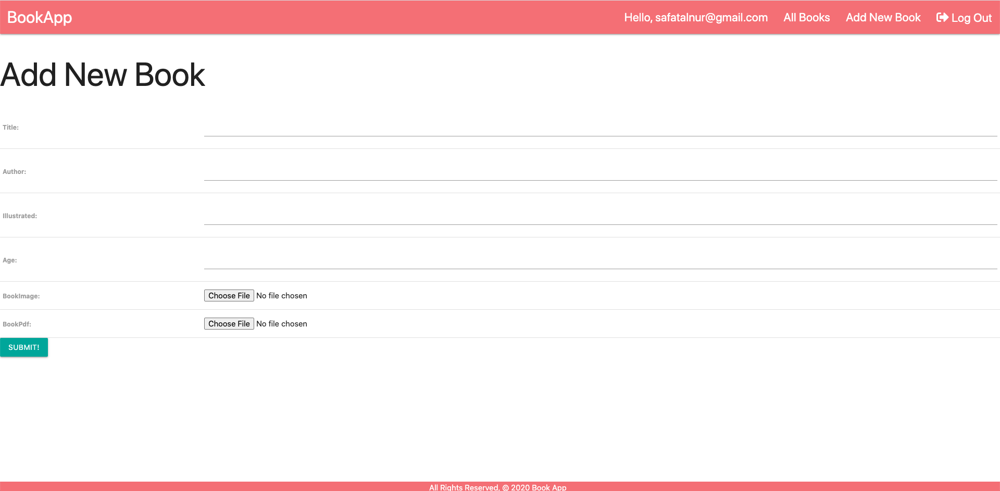

# Children's Book App


## Technologies Used

* [PostgresQL](https://www.postgresql.org/)
* [Python3](https://www.python.org/)
* [Django](https://www.djangoproject.com/)
* [Materialize](https://materializecss.com/)
* [CSS3](https://www.w3schools.com/css/)

## Installation
1. Create a "bookApp" PostgresQL database, ```$ createdb bookApp```
2. clone the project from GitHub (https://github.com/safatalnur/bookApp)
3. Create database migration files ```$ python3 manage.py makemigrations```
4. Synchronize database ```$ python3 manage.py migrate```
5. Run the server ```$ python3 manage.py runserver```
6. Browse to ```localhost:8000```


## Planning Stage
* [Trello Board](https://trello.com/b/JGXywzXC)
* Entity Relationship Diagram (ERD)
* Wire Frame Design
* Landing Page

* All Books page

* Add New Book page

* pdf file page


## Features
* Sign-up as a new user in the Landing Page
* View all the books in "All Books"
* Go to "Details" and click "READ THE BOOK" to open the pdf file
* Ability to edit or delete as a user
* Like/ Dislike the book
* Click on "Add New Book" to create your own book. (book has to be in pdf file)

## Model-View-Template (MVT) model
Creating a PostgresQL schema 
```javascipt
from django.db import models
from django.urls import reverse
from django.contrib.auth.models import User

# Create your models here.
class Book(models.Model):
    title = models.CharField(max_length = 100)
    author = models.CharField(max_length = 100)
    illustrated = models.CharField(max_length = 100)
    age = models.CharField(max_length = 100)
    likes = models.ManyToManyField(User, related_name='book_posts')
    bookImage = models.ImageField(default='default.jpg', blank=True)
    bookPdf = models.FileField(default='default.pdf', blank=True)

    def __str__(self):
        return self.title

    # def get_absolute_url(self):
    #     return reverse('detail', kwargs={ 'book_id': self.id })

    def total_likes(self):
        return self.likes.count()
```
## Screenshots
* Add Page Screen shot:


## Environment
* macOS catalina 10.15.5
* vsCode 1.46.1

## Future Improvments
* User can only delete his/her books
* Upload assets to amazon s3

## Author
* Safat Alnur(https://github.com/safatalnur) 

## License
(MIT)

## Acknowledgments
[@GeneralAssembly](https://generalassemb.ly/)
[@MonkeyPen](https://monkeypen.com/)
